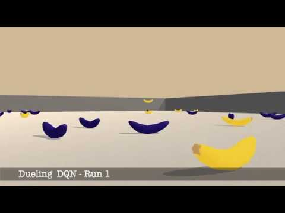

# Project 1 - Udacity Deep Reinforcement Learning Nanodegree

## Collecting Bananas with Deep Q Networks!

<center></center>

### Problem Formulation

The agent is moving on a 2D surface, surrounded by walls from each side. The agent must collect YELLOW bananas while avoiding DARK bananas. Each time the agent collects a YELLOW banana, it will receive `+1`, and receives `-1` collecting DARK banana, and it receives `0` otherwise.

### State Space

A ``37`` dimensional vectors, contains Velocity of the Agent and sensory information about objects in the vicinity of the Agent.

Sample observation looks like this :

```python
 1.         0.         0.         0.         0.84408134 0.
 0.         1.         0.         0.0748472  0.         1.
 0.         0.         0.25755    1.         0.         0.
 0.         0.74177343 0.         1.         0.         0.
 0.25854847 0.         0.         1.         0.         0.09355672
 0.         1.         0.         0.         0.31969345 0.
 0.        
 ```

### Action Space

Agent can be controlled with ``4`` action inputs:

* ``0`` - move forward.
* ``1`` - move backward.
* ``2`` - turn left.
* ``3`` - turn right.

### Solve Criteria

The Environment is considered solved if the average score for ``100`` consecutive episode reaches ``13``. We also consider the task is strongly solved, if an agent scores more than ``17`` in ``100`` consecutive episodes (its average score).

## Instructions and Structure

### Notebooks

1. Use ``Navigation-Train.ipynb`` notebook for Training.
1. Use ``Navigation-Test.ipynb`` notebook for testing trained agents.
1. For Report check out ``Report.ipynb`` notebook.
1. ``Benchmark.ipynb`` notebook contains code for performing Benchmarks.

### Scripts file

1. ``agents.py`` contains a code for a Generic Q Agent.
1. ``brains.py`` contains the definition of Neural Networks (Brains) used inside an Agent.

### Folders

1. ``trained_agents`` folder contains saved weights for trained agents.
1. ``images`` folder contains images used in the notebooks.
1. ``movies`` folder contains recorded movies from each Agent.

##  Seting up Environment

It is highly recommended to create a separate python environment for running codes in this repository. The instructions are the same as in the Udacity's Deep Reinforcement Learning Nanodegree Repository. Here are the instructions:

1. Create (and activate) a new environment with Python 3.6.

	- __Linux__ or __Mac__: 
	```bash
	conda create --name drlnd python=3.6
	source activate drlnd
	```
	- __Windows__: 
	```bash
	conda create --name drlnd python=3.6 
	activate drlnd
	```
	
2. Follow the instructions in [this repository](https://github.com/openai/gym) to perform a minimal install of OpenAI gym.

- Here are quick commands to install a minimal gym, If you ran into an issue, head to the original repository for latest installation instruction:


	```bash
	pip install box2d-py 
	pip install gym
	```  

	
3. Clone the repository (if you haven't already!), and navigate to the `python/` folder.  Then, install several dependencies.
```bash
git clone https://github.com/taesiri/udacity_drlnd_project1
cd drlnd-project-1/
pip install .
```

4. Create an [IPython kernel](http://ipython.readthedocs.io/en/stable/install/kernel_install.html) for the `drlnd` environment.  
```bash
python -m ipykernel install --user --name drlnd --display-name "drlnd"
```

5. Open the notebook you like to explore.

## Video

See it in action here:

[](http://www.youtube.com/watch?v=3A01udy2BjU "Bananaaaa!")
